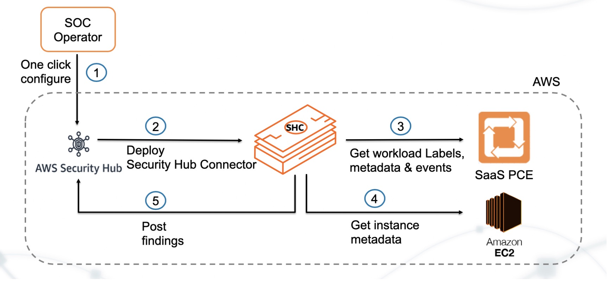

# Illumio & AWS Security Hub Integration

[](http://slack.illumiolabs.com)
[](LICENSE)

**Project Description**

This repo contains the code for Illumio security hub connector that allows customers to convert 
Illumio events into AWS security hub findings while enriching them with Illumio labels and EC2 metadata

**Project Technology stack** 

The security hub connector is written in python3.6 and can run in a virtual environment with python3.6

**Project workflow** 

 <!-- .element height="20%" width="20%" -->

## Dependencies

The requirements for this project are recorded in requirements.txt file and need to be installed as explained
in the Installation section below.

## Installation

1. Clone this repository using the following command:
   ```
   git clone github.com/illumiolabs/aws-security-hub
   ```
1. Create a virtual environment with python 3.6 on a Linux machine in AWS. 
You can use the following link to do so: https://janikarhunen.fi/how-to-install-python-3-6-1-on-centos-7
1. Once the virtual environment is setup, install the requirements for the package using the following command in the virtual environment
   ```
   pip install -r requirements.txt
   ```
1. Setup the environment variables with the Illumio PCE API configuration information using the following commands:
   ```
   export ILO_API_VERSION=2

   #Replace PCE-URL with the PCE hostname in your deployment without the https
   
   export ILLUMIO_SERVER=PCE-URL:8443

   export ILO_API_KEY_ID=API-KEY-ID

   export ILO_ORG_ID=1

   export ILO_PORT=8443

   export ILO_API_KEY_SECRET=API-KEY-SECRET
   ```
1. The API Key mentioned above can be obtained from the Illumio PCE. 
1. Also, verify that the above environment variables are visible when the following command is run inside the virtual environment, on the machine 
   ```env```
1. Once the environment variables are set, make sure that no other credentials exist in $HOME/.illumio directory
1. Run the following command to start the Illumio security hub connector:
   ```
   cd aws-security-hub; sh run.sh
   ```
1. The service will log in aws-security-hub/app.log file

## Support
 
The AWS Security Hub integration code and Lambda Function for custom action is released and distributed as open source software subject to the (LICENSE). 
Illumio has no obligation or responsibility related to the AWS Lambda Function with respect to support, maintenance, availability, security or otherwise. 
Please read the entire (LICENSE) for additional information regarding the permissions and limitations. You can engage with the author & contributors team and community on SLACK

## Help or Docs 

If you have questions, please use slack for asking them.
If you have issues, bug reports, etc, please file an issue in this repository's Issue Tracker.

## Contributing

Instructions on how to contribute:  [CONTRIBUTING](CONTRIBUTING.md).

## Links

 * Screencast showing the Integration working https://labs.illumio.com
 * Illumio documentation page for configuring Illumio ASP https://support.illumio.com/public/documentation/index.html
