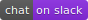
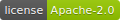
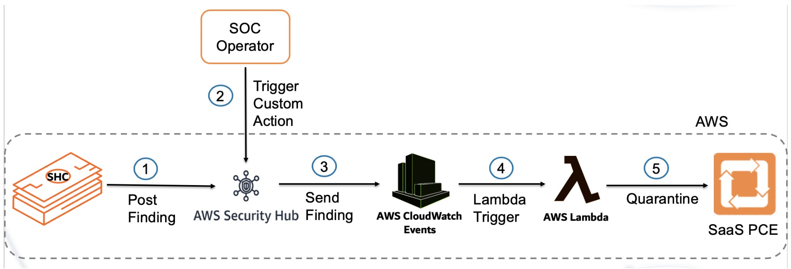

# AWS Security hub custom action using Illumio

**Project Description**
This repo contains the code for lambda function that allows users to take custom action on critical
Illumio findings in AWS Security Hub by taking the Quarantine action on the workload in Illumio PCE

**Project Technology stack** 
The lambda function is written in python3.6 and can run in a virtual environment with python3.6

**Project workflow** 

## Installation

Detailed instructions on how to install, configure, and get the project running are mentioned 
in [INSTALL](INSTALL.md) document.

## Help or Docs 

If you have questions, please use slack for asking them.
If you have issues, bug reports, etc, please file an issue in this repository's Issue Tracker.

## Support
 
The AWS Lambda Function is released and distributed as open source software subject to the (LICENSE). 
Illumio has no obligation or responsibility related to the AWS Lambda Function with respect to support, maintenance, availability, security or otherwise. 
Please read the entire (LICENSE) for additional information regarding the permissions and limitations. You can engage with the author & contributors team and community on SLACK

## Contributing

Instructions on how to contribute:  [CONTRIBUTING](CONTRIBUTING.md).

## Links

 * Screencast showing the Lambda working https://labs.illumio.com
 * Illumio documentation page for configuring Illumio ASP https://support.illumio.com/public/documentation/index.html